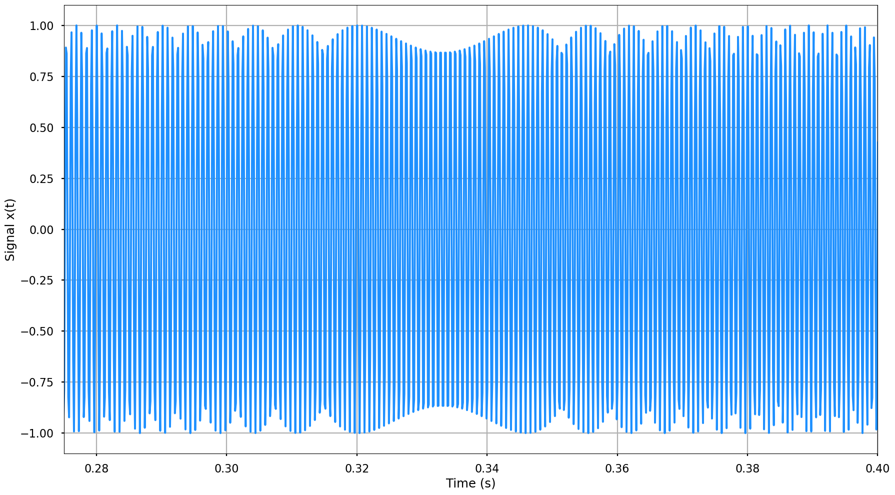
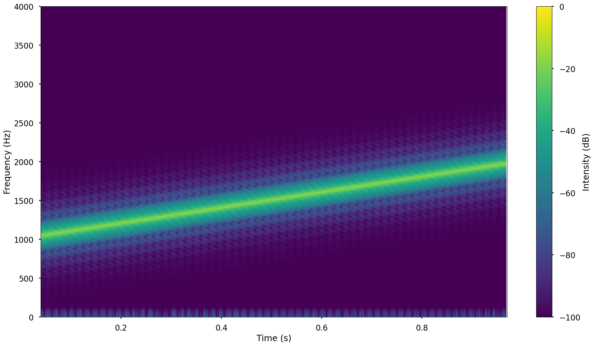
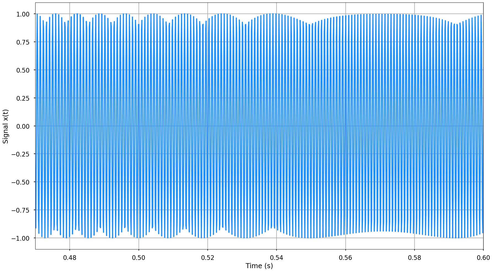
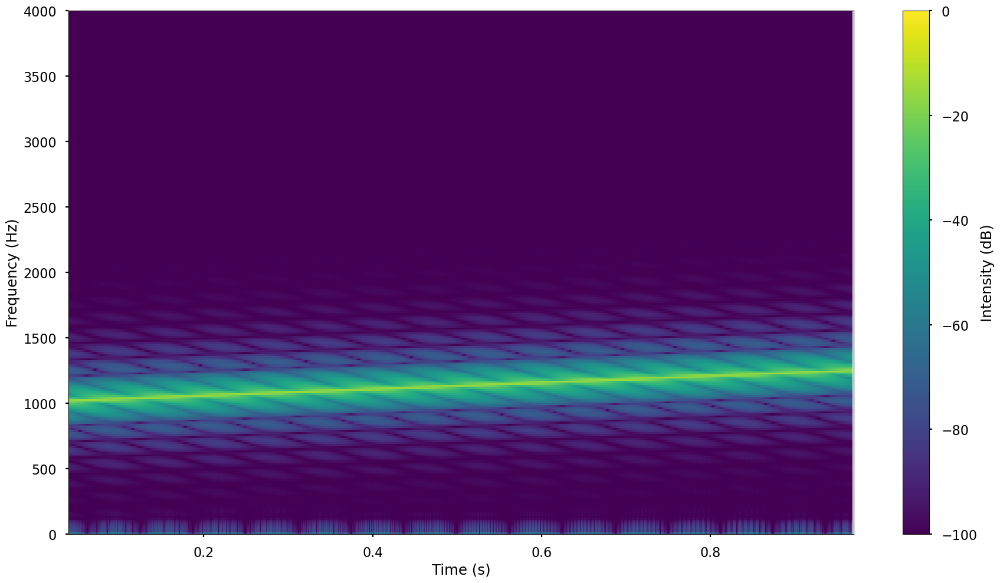
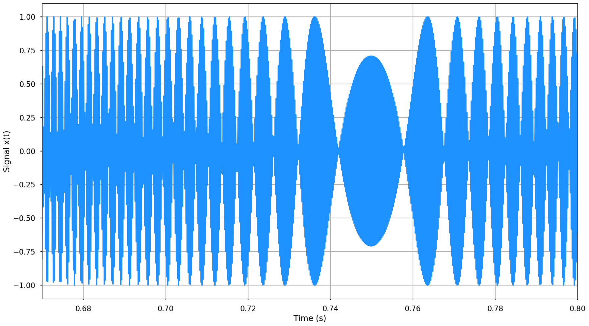
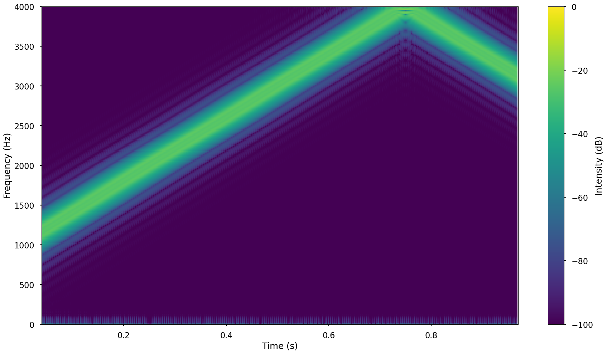
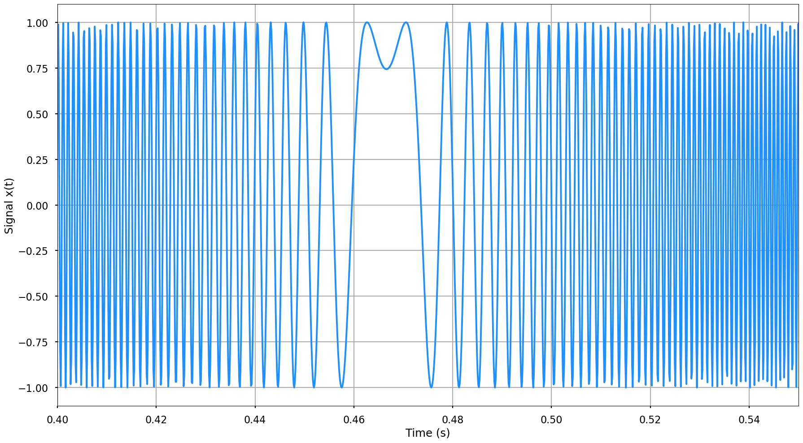
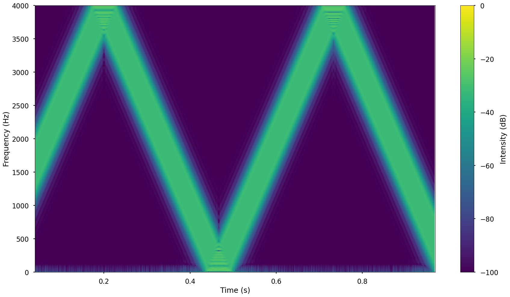
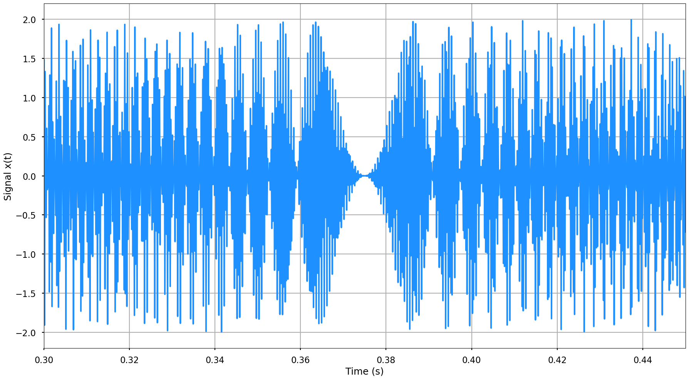
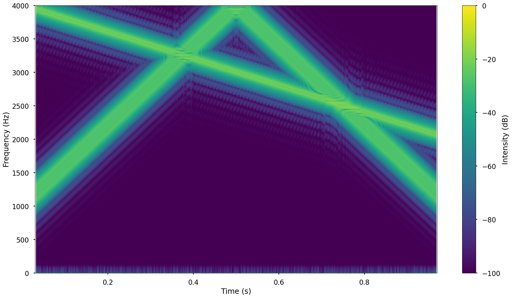

# 📡 Chirp Signal Analysis and Aliasing Demonstration

This project explores **chirp signal generation** and the impact of varying frequency sweep durations (`t₂`) on aliasing and time-frequency characteristics. Chirp signals, which linearly increase or decrease in frequency over time, are essential in radar, sonar, and acoustic applications.

We demonstrate the effects of sweep speed, frequency resolution, and aliasing through Python-generated waveforms and spectrograms.

---

## 🧮 Mathematical Background

A chirp signal is defined as:

```math
x(t) = \sin\left(\phi(t)\right), \quad \phi(t) = \phi_0 + 2\pi \int_0^t f(\tau)\,d\tau
```

For a linear chirp:

```math
f(t) = c t + f_0 \Rightarrow \phi(t) = \phi_0 + 2\pi\left(\frac{c}{2} t^2 + f_0 t\right)
```

Hence:

```math
x(t) = \sin\left[\phi_0 + 2\pi\left(\frac{c}{2}t^2 + f_0 t\right)\right]
```

Where:
- \( f_0 \): Initial frequency
- \( c \): Chirp rate
- \( t_2 \): Total sweep time

---

## 🔍 Experimental Cases

Each test varies the sweep duration \( t_2 \) and analyzes the output waveform and spectrogram.

---

### 📈 Case 1: Sweep from 1000 Hz to 2000 Hz in 1 Second

 

- **Observation**: Clean linear increase in frequency from 1 kHz to 2 kHz.
- Sweep duration: `t₂ = 1 s`

---

### 🐢 Case 2: Slower Sweep from 1000 Hz to 1500 Hz (`t₂ = 2 s`)

 

- Frequency sweep is slower.
- Less total frequency shift visible in the spectrogram.

---

### ⚡ Case 3: Faster Sweep from 1000 Hz to 3000 Hz (`t₂ = 0.5 s`)

 

- The signal sweeps rapidly across a broader range.
- Steeper slope in the spectrogram.

---

### 🚨 Case 4: Aliased Sweep from 1000 Hz to 4000 Hz (`t₂ = 0.2 s`)

 

- Frequency exceeds Nyquist limit (assumed 4000 Hz sampling rate).
- Aliasing occurs: signal folds back to lower frequencies (~2000 Hz).

---

### ⛔ Case 5: Folded Chirp — Frequency Folds Back (Aliased Reversal)

 

- The chirp ramps from 1000 Hz to 4000 Hz and folds back to 2000 Hz.
- Due to exceeding Nyquist frequency.

---

## 🎓 Summary

| Case | Sweep Duration \( t_2 \) | Frequency Range       | Aliasing? |
|------|--------------------------|------------------------|-----------|
| 1    | 1 s                      | 1000–2000 Hz           | ❌ No     |
| 2    | 2 s                      | 1000–1500 Hz           | ❌ No     |
| 3    | 0.5 s                    | 1000–3000 Hz           | ❌ No     |
| 4    | 0.2 s                    | 1000–4000 Hz           | ✅ Yes    |
| 5    | 0.2 s                    | 1000–4000–2000 Hz      | ✅ Yes    |

---

## 💻 Requirements for Running the Code

Run the script to generate chirp signals and their spectrograms:

```bash
python chirp_signal.py
```

Or explore via Jupyter Notebook:

```bash
jupyter notebook chirp_analysis.ipynb
```

---

## 📚 References

- [Scipy Signal Documentation](https://docs.scipy.org/doc/scipy/reference/signal.html)
- Nyquist–Shannon Sampling Theorem
